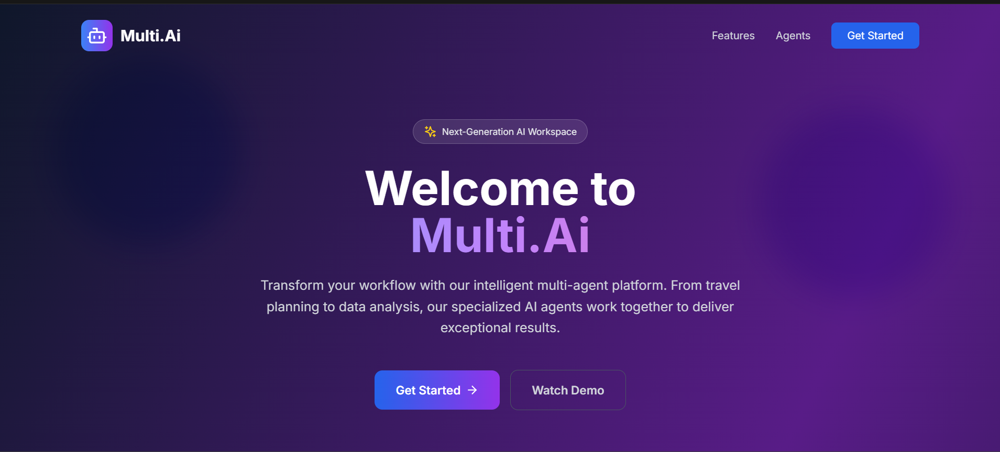
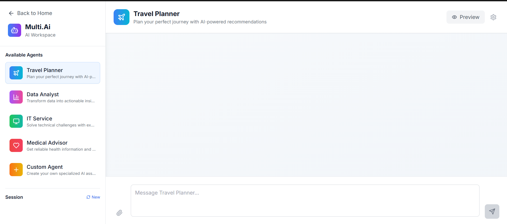
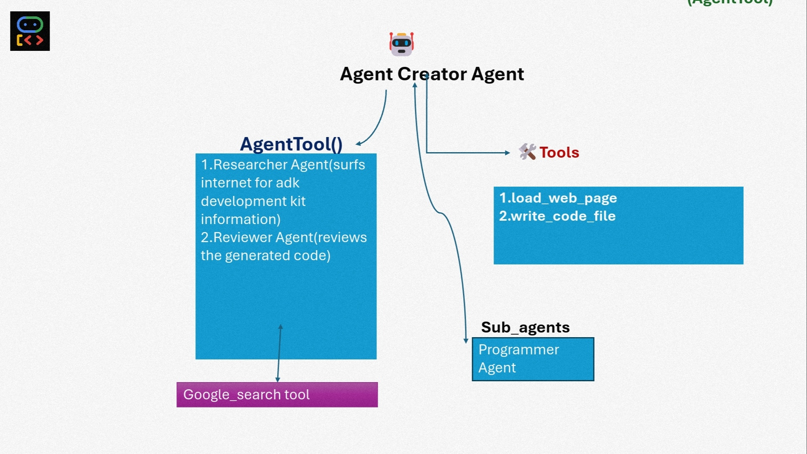
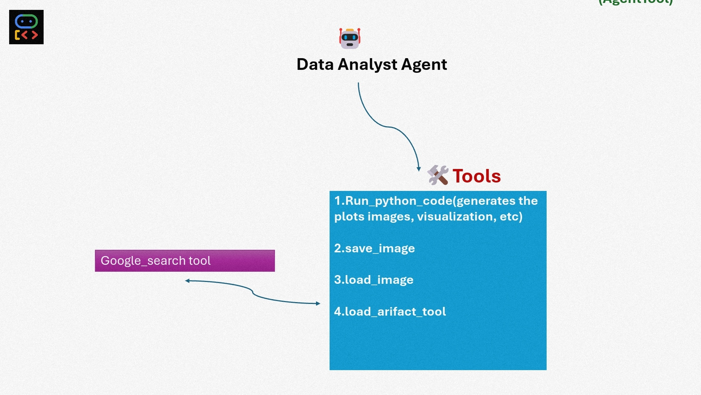
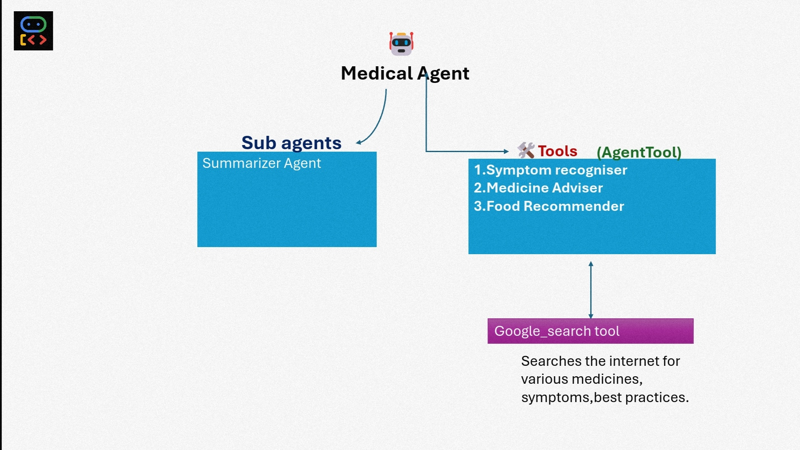
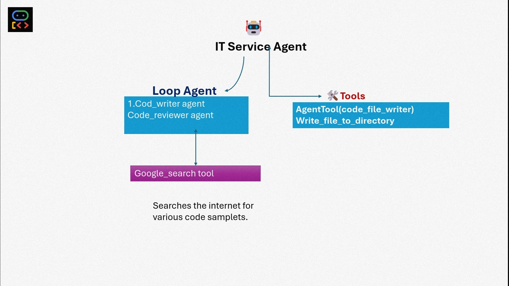

# 🌐 Multi AI

Multi AI is an advanced multi-agent system built on the **Google ADK (Agent Development Kit)** architecture. It features a dynamic **Custom Agent Creator** that builds and manages specialized agents for different domains, including travel planning, data analysis, medical diagnostics, IT software generation, and more.

---

## The Workspace of the Multi AI 
## 🚨 Problem Statement: Personal AI Workforce Marketplace

### 🧠 Democratizing Scalable Productivity through an On-Demand Personal AI Workforce

Despite the rise of AI tools, access to **specialized and scalable expertise** remains out of reach for billions of individuals and small businesses.

Entrepreneurs, creators, and non-technical users often **lack the resources** to hire skilled teams (e.g., developers, analysts, marketers, legal experts) or leverage advanced AI workflows.

Meanwhile, the AI agent ecosystem is:
- Fragmented
- Inaccessible to non-experts
- Difficult to integrate and scale

> ❌ **There is no unified platform that enables anyone to assemble a team of AI specialists on-demand — with the simplicity of ordering food or booking a ride.**

---

### 🎯 Vision

To create a **Personal AI Workforce Marketplace** — a user-friendly platform where anyone can instantly hire and orchestrate **task-specialized AI agents** (marketers, coders, analysts, legal advisors, etc.) powered by **modular ADK agents** and cloud APIs — enabling **solo entrepreneurs to operate like scaled enterprises**.

---

### ❌ Core Pain Points Today

- High barrier to entry for solo entrepreneurs to access expert services  
- Fragmented AI tools with poor interoperability and UX  
- No scalable infrastructure for non-technical users to "hire" AI talent  
- Talent bottlenecks in creative, technical, and business domains  

---

## 🧠 Solution: Multi AI Platform

Multi AI addresses these challenges by offering:

- **Custom Agent Creator Agent** — a generative meta-agent that builds domain-specific agents  
- **Modular architecture** using **Google ADK**  
- **Plug-and-play specialized agents** (Travel, Medical, IT, etc.)  
- **User-friendly orchestration layer** (in development) for non-technical users

---

## 📁 Architecture Overview

The system is powered by a modular agent framework. The **Custom Agent Creator Agent** dynamically builds and configures specialized agents on demand.

---

## 🤖 AI Agents

### ✈️ Travel Planner Agent

Plans personalized itineraries, books accommodations, and provides travel suggestions using real-time data.

---

### 📊 Data Analyst Agent

Analyzes structured and unstructured datasets, generates reports, and supports decision-making through data insights.

---

### 🩺 Medical Agent

Assists in preliminary diagnosis, health monitoring, and connects users to health resources based on symptoms and records.

---

### 🛠️ IT Service Agent

Generates production-ready software components, APIs, and automation scripts based on user requirements. Supports rapid prototyping and deployment-ready solutions.

---

### 🧬 Custom Agent Creator Agent

The core intelligence behind Multi AI — responsible for dynamically creating, deploying, and updating all other agents based on user input, needs, or domain requirements.

---

## 🧠 Powered by Google ADK

Multi AI leverages the **Google Agent Development Kit (ADK)** to ensure:
- Scalable agent interactions
- Secure communication and deployment
- Modularity for agent upgrades or extensions

---

## 📦 Folder structure

## 🧪 How to Use the Agents via ADK Web

Multi AI runs its agents inside a **Web-based UI powered by Google ADK**. The platform allows you to interact with your AI team through a no-code interface.

### ✅ Step 1: Install Dependencies

Create a virtual environment (recommended):

python -m venv venv
source venv/bin/activate  # On Windows: venv\Scripts\activate
Install the required Python packages:

pip install fastapi matplotlib seaborn pandas google-adk
##📝 Standard libraries like os and webbrowser do not need to be installed separately.

##🚀 Step 2: Launch the ADK Web UI
Run the following command from your terminal:

##adk web
This will open the ADK Web UI in your browser automatically.
If it doesn't, open your browser and go to:

##http://localhost:8000
###🧠 Step 3: Select and Use Agents
In the web UI, choose from the available agents in the top menu:

Travel Planner Agent

Data Analyst Agent

Medical Agent

IT Service Agent

Custom Agent Creator Agent

Start a conversation with any agent by clicking on it.

Assign tasks in plain English (e.g., "Generate a basic weather app in Flask", or "Analyze this Excel file").

The agent will begin working immediately and provide step-by-step responses.

💡 Example Use Cases
“Plan a 3-day trip to Kyoto with hotels and sightseeing.”

“Analyze this sales data CSV and plot top 5 products.”

“I need a FastAPI backend with a MySQL database.”

“Create a marketing assistant agent that writes tweets.”

###🖼️ Step 2: Run the Streamlit Frontend
In a new terminal, run:

streamlit run streamlit_app.py
This opens your Streamlit app at http://localhost:8501.

##🧠 What the Streamlit App Can Do
In your streamlit_app.py, you can:

Let users select an agent (Travel, Medical, etc.)

Provide an input box to send prompts

Display the agent's responses in real-time

Allow users to upload files (e.g. CSV for Data Analyst)

